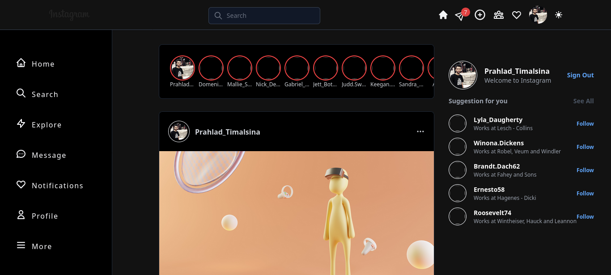

## Link



Deploy the example using [Vercel](https://vercel.com?utm_source=github&utm_medium=readme&utm_campaign=next-example):

[](https://vercel.com/new/git/external?repository-url=https://github.com/vercel/next.js/tree/canary/examples/with-tailwindcss&project-name=with-tailwindcss&repository-name=with-tailwindcss)

# Overview

- **Framework**: [Next.js](https://nextjs.org/)
- **Database**: [Firebase](https://firebase.google.com/)
- **Authentication**: [NextAuth.js](https://next-auth.js.org/)
- **Deployment**: [Vercel](https://vercel.com)
- **Styling**: [Tailwind CSS](https://tailwindcss.com/)


## Description
 👉 Build a fully functional Instagram feed with comments!!!
 👉  Use Tailwind CSS to build a FULLY mobile responsive web app!
 👉  Build a custom authentication screen using NextAuth!
 👉  use Firebase storage API and upload images!
 👉 use Recoil as a state management tool!
 👉 use dark mode!
## Running Locally


```bash
git clone https://github.com/prahladtimalsina/instagram-clone-2023.git
cd instagram-clone-2023
yarn install
yarn dev
```

## Create a `.env.local` file 
- **GOOGLE_CLIENT_ID**=[google client id]
- **GOOGLE_CLIENT_SECRET**=[google client secret]
- **NEXTAUTH_URL**=[next auth url]
- **SECRET**=[generate secret from terminal]


